# [Machine Learning Figures](https://github.com/guillaume-chevalier/Machine-Learning-Figures)

## Timeline

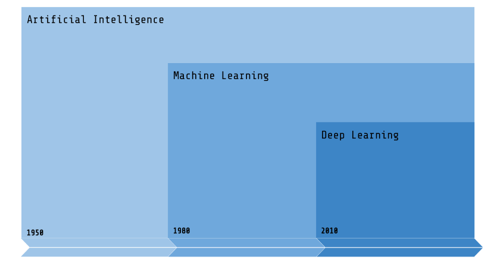

## The Business Process

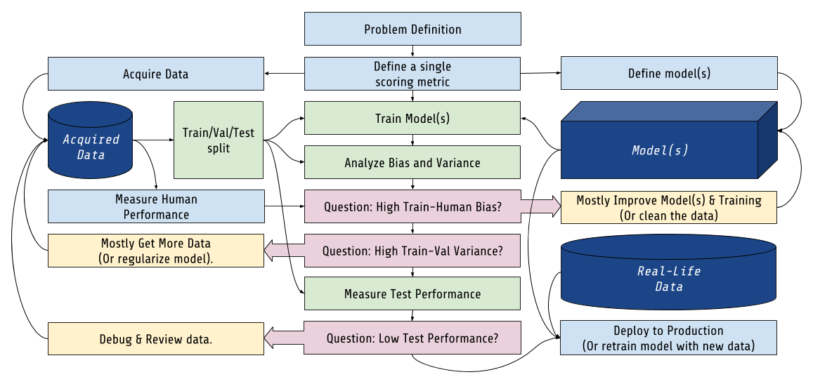

## Choosing a model

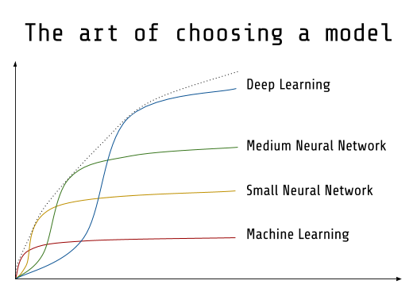

## Moore's Law

Note that this figure is available under the [Creative Commons Attribution 4.0 International Public (CC BY)](https://github.com/karlrupp/microprocessor-trend-data/blob/master/LICENSE.txt) License.

## Neuron

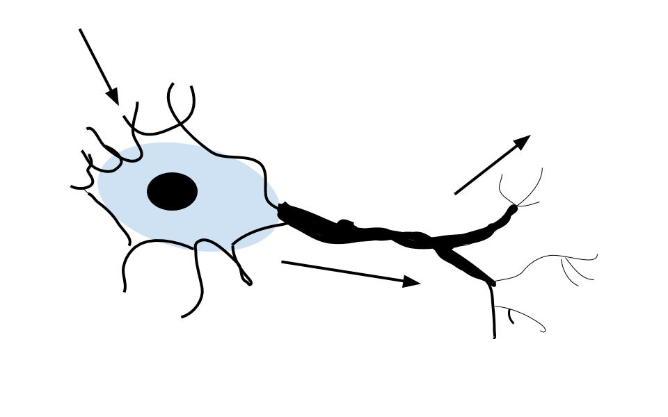

## Artificial Neuron

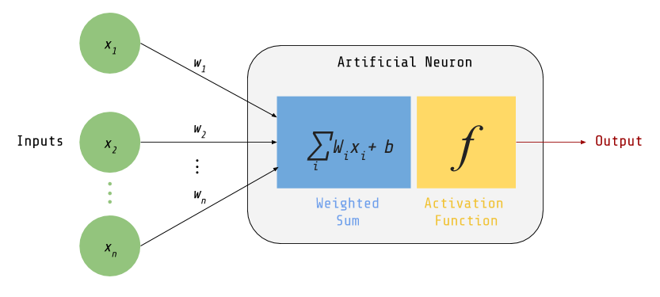

## Neural Network

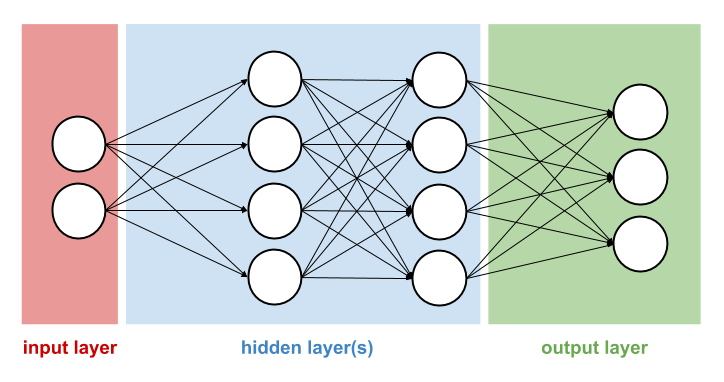

## Gradient Descent Updates

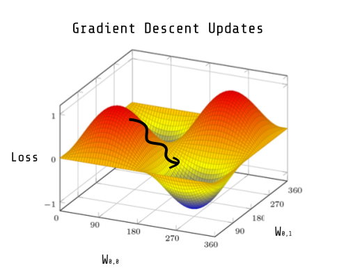

## Residual neural network (ResNet)

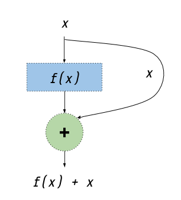

## RNN architecture

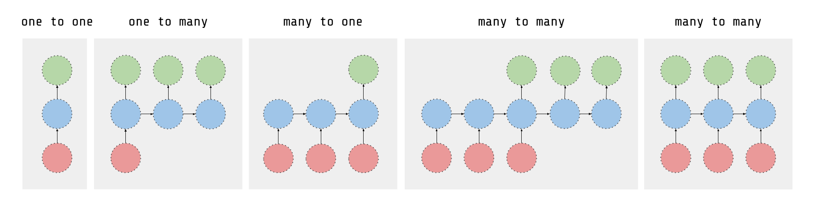

## LSTM formula

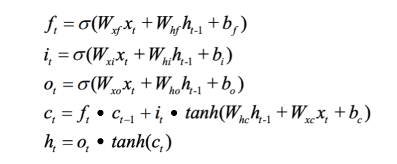

## Encoder Decoder Seq2Seq

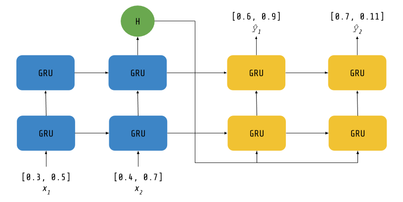

## Backpropagation Through Time (BPTT)

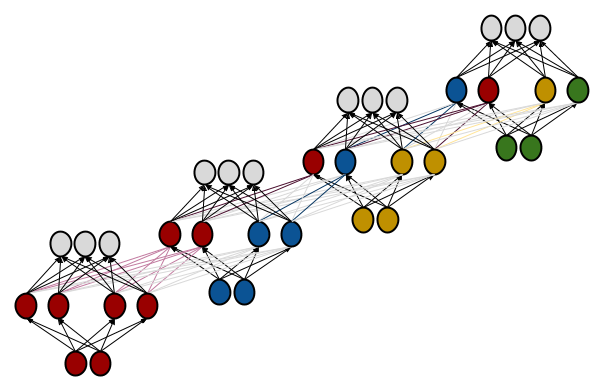

## Effect of data quantity on error

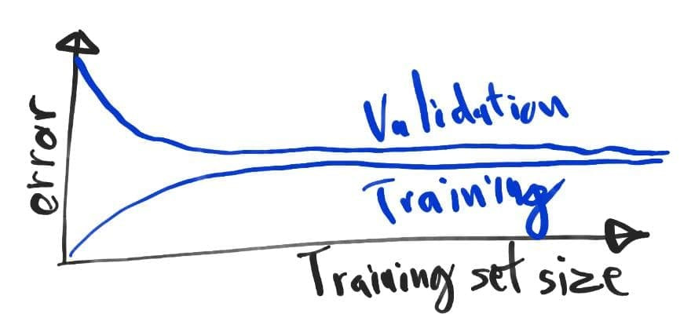

## Effect of learning rate on loss

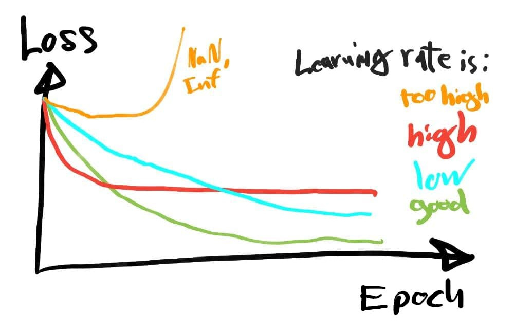

## Effect of model complexity on loss

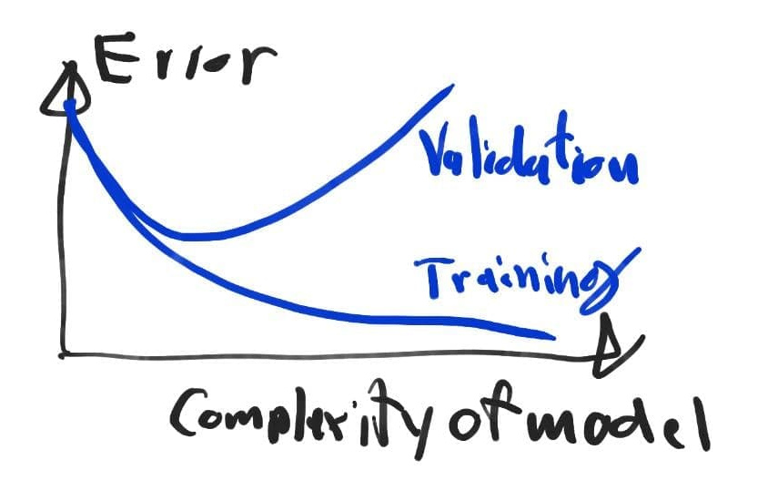

## Grid Search v.s. Random Search

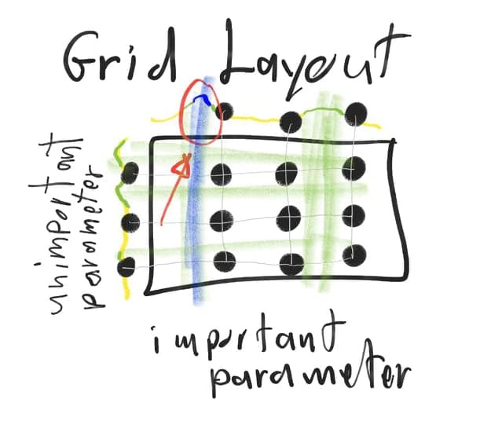

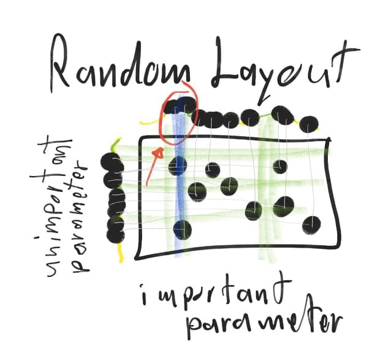

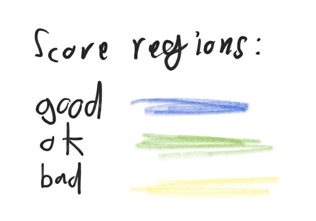

## Hyperband

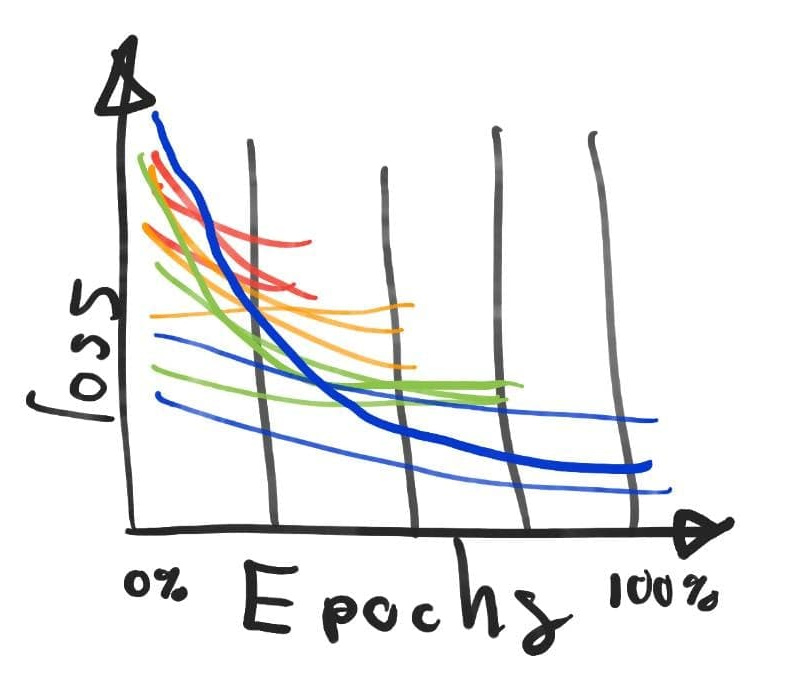

## License

This work is licensed under a [Creative Commons Attribution-ShareAlike 4.0 International](https://creativecommons.org/licenses/by-sa/4.0/) License.

[Link to this page](https://github.com/Neuraxio/Machine-Learning-Figures) to use our figures with citation attributed to Neuraxio.
